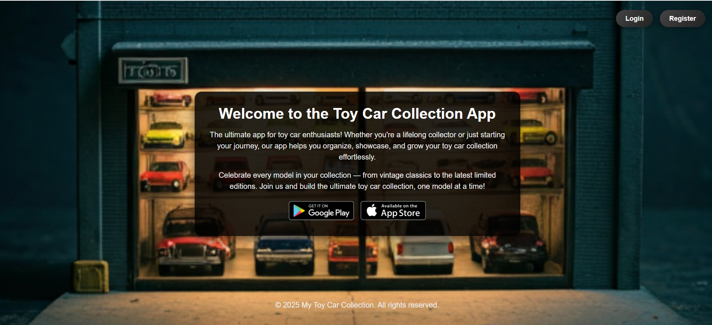
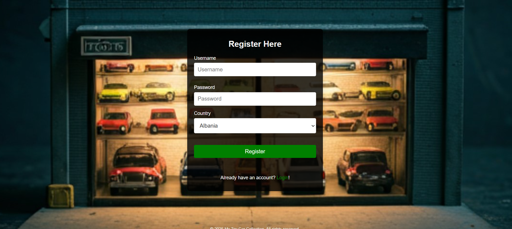
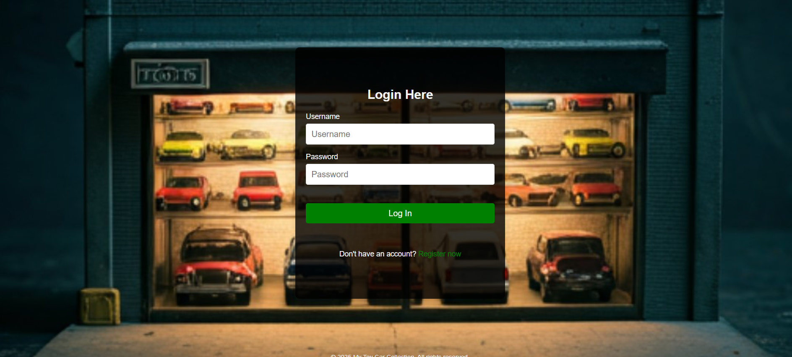
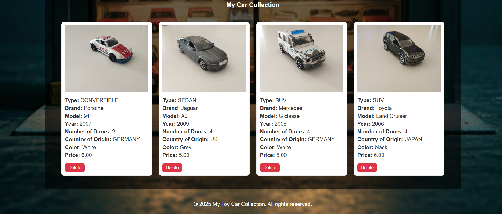

# 🚗 Toy Car Collection App

Welcome to the **Toy Car Collection App**—the ultimate playground for toy car enthusiasts! Whether you're a lifelong collector or just starting your journey, this app lets you build, showcase, and manage your dream garage while connecting with fellow collectors worldwide.

## 🔥 What You Can Do

- **Build Your Collection** – Add toy cars with detailed info like brand, model, year, and rare features.
- **Show Off Your Garage** – Upload stunning images and descriptions of your prized cars.
- **Connect & Engage** – Follow other collectors, like posts, and share your latest finds.
- **Wallet & Transactions** – Manage your virtual funds, trade cars, and track purchases.
- **Stay Organized** – Keep a seamless record of your growing collection and transaction history.

## 📸 Screenshots

### Home Page  

### Registration and Login page
Users can register an account.
Upon successful registration, users are redirected to login.

### Car Collection Page  
This page allows users to view and manage their entire collection of toy cars. Each car is displayed with detailed information such as the brand, model, year, and unique features. Users can add new cars, edit details, or remove items from their collection.

### Car Collection Page  

## 🌟 Why You'll Love It!

- One-stop hub for all your toy cars—no more messy spreadsheets!
- Sleek & intuitive design makes collecting more fun than ever.
- Social & interactive—join discussions, comment on posts, and make new collector friends.
- Secure wallet system ensures hassle-free transactions and trades.

Whether you’re a casual collector or a hardcore hobbyist, the **Toy Car Collection App** keeps your passion organized, accessible, and more exciting than ever. **Start building your dream garage today!** 🚀
